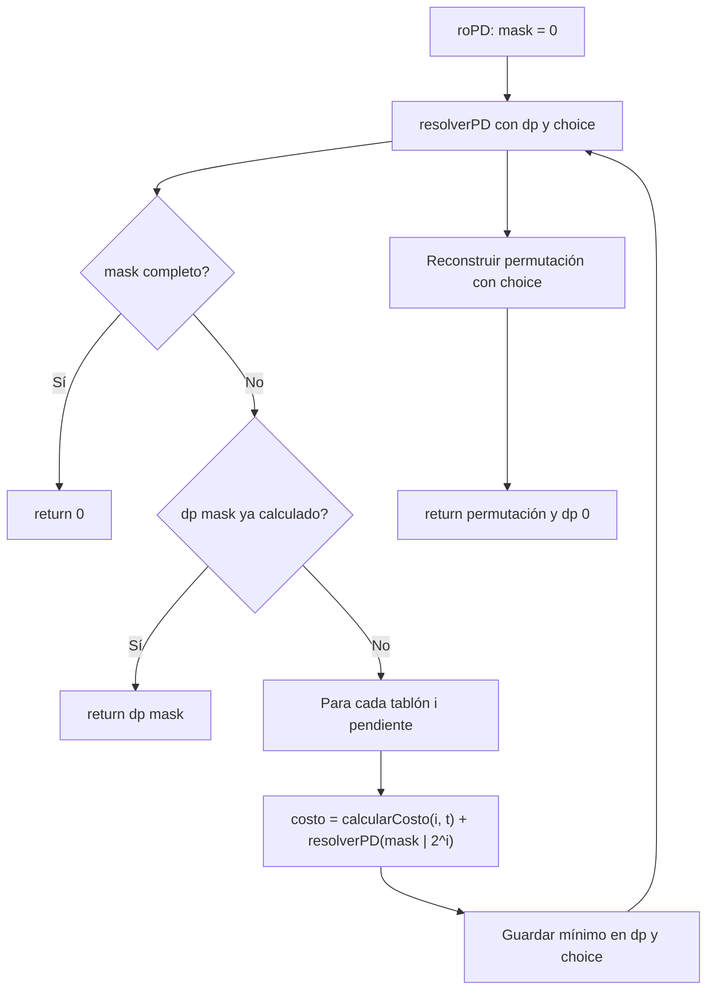

# Explicación de la programación dinámica (`roPD` / `roD`)

Este documento describe la solución dinámica implementada en `Finca::roPD()`. El método `roD()` existe como alias y delega en `roPD()`.

---

## 1. ¿Funciona?

Sí. La implementación con **máscaras de bits** fue probada contra **fuerza bruta** (`roFB`) en el caso de `finca.txt`:

| Método | Costo mínimo (CR) | Programación óptima (π) |
|--------|-------------------|-------------------------|
| `roFB` | 160               | `< 1, 2, 3, 4, 0 >`   |
| `roPD` | 160               | `< 1, 2, 3, 4, 0 >`   |

Mismo costo y misma permutación → la DP encuentra la solución exacta en ese caso.

---

## 2. Idea general

Hay que elegir un **orden** para regar `n` tablones. Cada orden produce un costo total distinto (penalizaciones según cuándo empieza el riego de cada uno).

- **Fuerza bruta:** prueba todas las permutaciones (`n!`).
- **Programación dinámica:** agrupa estados por **qué tablones ya se regaron**, sin importar el orden en que se regaron. Solo hay `2^n` conjuntos distintos.

Usamos un entero `mask` (máscara de bits): el bit `i` en 1 significa que el tablón `i` ya fue regado.

---

## 3. Flujo del algoritmo



### Paso 1 — Tiempo desde la máscara

`tiempoDesdeMascara(mask)` suma el `tr` de todos los tablones con bit en 1. Ese valor es el instante en que podemos empezar a regar el siguiente tablón.

### Paso 2 — Resolver con memoización

`resolverPD(mask, n, dp, choice)`:

1. **Caso base:** si `mask == (1 << n) - 1`, no falta nada → costo `0`.
2. **Memo:** si `dp[mask] != -1`, devolver el valor guardado.
3. **Transición:** para cada `i` no regado (`!(mask & (1 << i))`):
   - Costo inmediato: `tablones[i].calcularCosto(tiempo_actual)`.
   - Costo futuro: `resolverPD(mask | (1 << i), …)`.
   - Quedarse con el mínimo y guardar el índice ganador en `choice[mask]`.

### Paso 3 — Reconstruir la permutación

Con `choice` ya lleno, desde `mask = 0`:

- En cada paso, `i = choice[mask]`.
- Añadir `i` a la permutación.
- Actualizar `mask |= (1 << i)`.

Tras `n` pasos se obtiene π.

---

## 4. Ejemplo pequeño (intuición)

Tres tablones (`n = 3`). Estados posibles: `000`, `001`, `010`, …, `111` (8 máscaras).

Desde `mask = 000` probamos regar 0, 1 o 2 primero; cada opción lleva a una nueva máscara con un bit más en 1. El mínimo de esas tres ramas es `dp[000]`.

Si dos órdenes distintos llegan a la misma máscara (por ejemplo `010` y `100` no son la misma máscara, pero distintos caminos pueden llegar a `011`), **solo calculamos `dp[011]` una vez**.

---

## 5. ¿Por qué funciona?

**Subestructura óptima:** si un orden completo es óptimo, la forma de regar los tablones que quedan después del primer paso debe ser óptima para la submáscara correspondiente.

**Subproblemas superpuestos:** muchos prefijos distintos pueden dejar regado el mismo conjunto → misma `mask` → misma entrada en `dp`.

**Tiempo determinado por la máscara:** el tiempo acumulado solo depende de **qué** tablones se regaron, no del orden. Por eso la clave del subproblema es solo `mask`, no `(mask, tiempo)` por separado.

---

## 6. Estructuras de datos usadas

```cpp
vector<double> dp(1 << n, -1);   // dp[mask] = costo mínimo desde mask
vector<int>    choice(1 << n);   // choice[mask] = próximo tablón óptimo
```

- `1 << n` = `2^n` (número de subconjuntos).
- `-1` en `dp` indica “aún no calculado” (el costo óptimo puede ser `0`).

---

## 7. Cómo probarlo

1. Compilar (desde la carpeta del proyecto, donde está `finca.txt`):

   ```bash
   g++ -std=c++17 -o main.exe main.cpp Objetos/Finca.cpp Objetos/Tablon.cpp
   ```

2. Ejecutar:

   ```bash
   ./main.exe
   ```

3. Comprobar en la salida:
   - Mismo **Costo mínimo (CR)** en `roFB` y `roPD`.
   - Misma **Programación óptima (π)** (o al menos el mismo costo si hay varias óptimas).

4. (Opcional) Probar con archivos pequeños (3–7 tablones) y repetir la comparación.

**Resultado esperado con `finca.txt` actual:** costo `160`, permutación `< 1, 2, 3, 4, 0 >`.

---

## 8. Límites y notas

- **Tamaño:** `2^n` crece rápido; es viable para `n` pequeño (típico en prácticas de ADA).
- **`roV`:** la versión voraz aún no está implementada en este proyecto.
- **Documentación formal:** ver `Descomposicion.md` para la recurrencia matemática y la tabla de funciones.

---

## 9. Relación entre `roPD` y `roD`

| Método  | Descripción                                      |
|---------|--------------------------------------------------|
| `roPD`  | Implementación real (DP con máscaras de bits)    |
| `roD`   | Llama a `roPD()`; mismo resultado                |

`main.cpp` invoca `roPD()` directamente en la prueba de programación dinámica.
